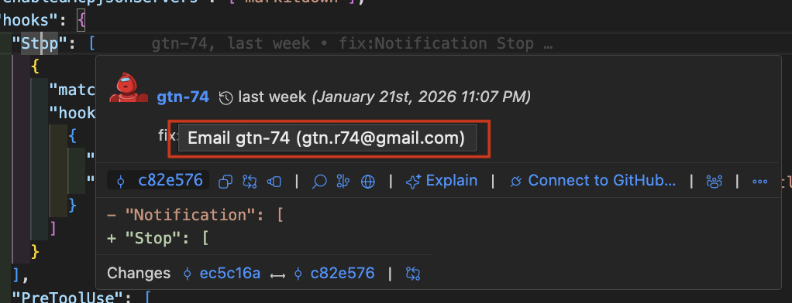
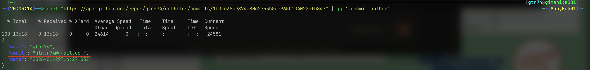
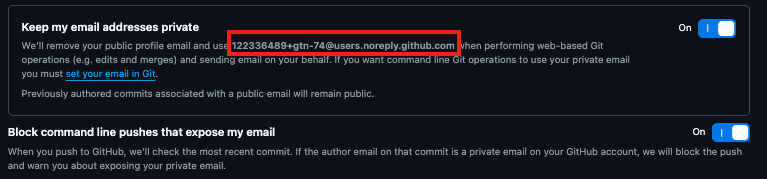
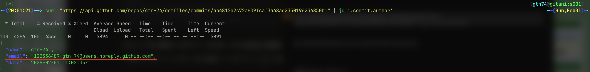
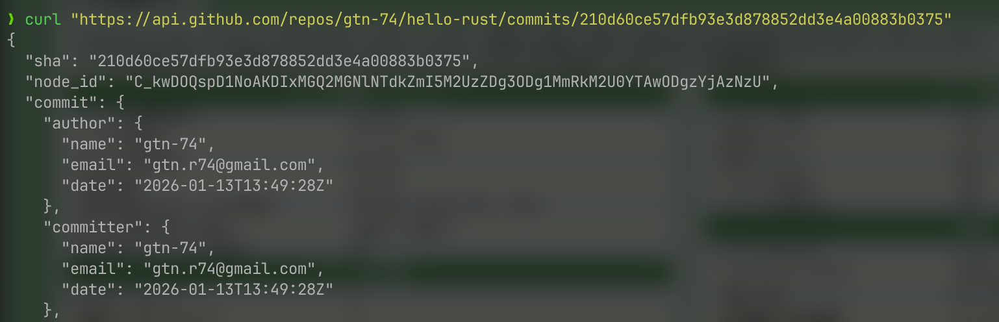

# よくよく考えたらPublic リポジトリにコミットしたらgit config emailって第三者がGithub APIから取得できるやん😇

## 導入

2年くらい前に全然知らない人から、メールをもらったことがありました。

もらったメールには、その人のGithubリポジトリのリンクが掲載されていたせいか、よく調べもせずGithub経由で送られたメールなんだと決めつけてしまいました。

でもSNSの見えるところにメールアドレスを記載してないつもりだったので、この人はどうやって自分にメールを送れたのだろうと思って一度調べたことがあります。

当時、どう調べたのか忘れてしまいましたが、Githubの機能を使って自分宛にメールを送れたんだ！と結論づけてしまっていました。最近きちんと調べて仕組みがわかりました。

自分が意図してない方法でGithubに登録しているメールアドレスが流出していました。

## この記事に書くこと

- GithubAPIからコミッターのEmailが取得できることを確かめる
- noreply メールアドレスについて
- WIP: Emailアドレスのコミッターをnoreply メールアドレスに変更する
- コミッターのEmailをリストで取れるアプリケーションを雑に紹介

## 前提

プライベートのGithubアカウントは、よっぽどな理由がなければリポジトリは、基本publicにしていました。

## 調査

自分の開発をやってる時に、Git lensのような拡張機能でカーソルホバーしたらこんな感じのポップアップが出てきて、名前の部分にカーソルを当てたらメールアドレスが表示されました。



てか、Publicリポジトリに、コミットしてる場合、このメールアドレスって、誰でも見れるんじゃないか？と急に思いました。

## GithubAPIからコミッターのEmailを取得する

公式の[コミット用の REST API エンドポイント](https://docs.github.com/ja/rest/commits/commits?apiVersion=2022-11-28#get-a-commit)を参考にcommitのAPIを叩いてみたところ、自分のEmailアドレスが取得できてしまいました。

### サンプルコード

```zsh
curl "https://api.github.com/repos/gtn-74/dotfiles/commits/1b01e35ce874e80c2753b5de965b104022efb847"
```



## noreply emailアドレス

メールアドレスのプライバシーを有効にしたいなら[noreply emailアドレス](https://docs.github.com/en/account-and-profile/reference/email-addresses-reference#your-noreply-email-address)を使いましょう。的なことが書いてありました。

## noreply emailを有効にするための手順

https://github.com/settings/emails の、Keep my email addresses private、Block command line pushes that expose my emailにチェックを入れる。

ローカルのgit config emailを赤枠のnoreply emailアドレスに変更する。



[コミットメールアドレスを設定する](https://docs.github.com/en/account-and-profile/reference/email-addresses-reference#your-noreply-email-address)

ローカルのgit config emailをnoreplyアドレスに置換後、コミットプッシュで取得できていたemailがnoreplyアドレスに変わっていることが確認できました。



## WIP: リポジトリ単位で、コミッターのEmailアドレスをnoreply メールアドレスに変更する

noreply アドレスを設定したから、メールアドレスは第三者から見られなくなった。というわけではありません。

noreplyアドレスを登録以前のコミットに関してemailは変更されないからです。



### 


## まだ終わりじゃないよ😇

git config　emailをすでにnoreplyアドレスでマスクしてる人こそ最後まで読んでほしいです。

noreplyアドレスを設定しても、これからのコミットのemailは、noreplyにできても、過去のemailは書き換えができていません。

こんなことでは諦めません。

Github Email Scraper

## 最後に

つらつら書きましたが、もちろんリポジトリをPublicにしている以上、ばれても良いemailアドレスを設定しています。

そして、noliplyを設定していなかったら、apiからメールアドレスが見えることも分かってたら、別に気にすることないかなと思います。

でも、自分の場合、emailが第三者から見えているっぽいアクションがあったにも関わらず、曖昧なままにしていたことは、すごく反省したいことだと思いました。

誰かの知肉になりますようにー🍖
